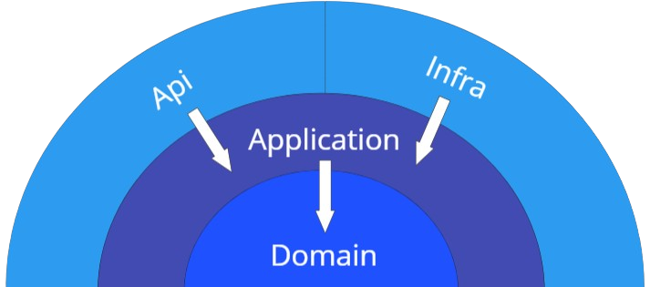
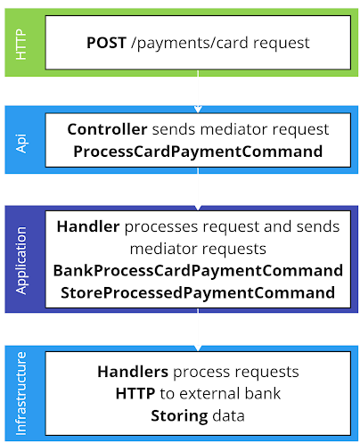

# Instructions for candidates

<details>
This is the .NET version of the Payment Gateway challenge. If you haven't already read the [README.md](https://github.com/cko-recruitment) in the root of this organisation, please do so now. 

## Template structure
```
src/
    PaymentGateway.Api - a skeleton ASP.NET Core Web API
test/
    PaymentGateway.Api.Tests - an empty xUnit test project
imposters/ - contains the bank simulator configuration. Don't change this

.editorconfig - don't change this. It ensures a consistent set of rules for submissions when reformatting code
docker-compose.yml - configures the bank simulator
PaymentGateway.sln
```

Feel free to change the structure of the solution, use a different test library etc.
</details>

## Solution

### Dependency layers

1. **Domain**: the core entities, configuration, types, exceptions etc shared across the domain.
2. **Application**: concerned with business logic and services. Defines abstractions to be implemented in infrastructure for external services.
3. **Infrastructure**: implements the abstractions from the application layer, concerned with implementing external services such as APIs and data stores.
4. **Api**: the presentation layer, dependent on the application layer for business logic and services. This is where the infrastructure layer is implemented through dependency injection.         



### Libraries

- **MediatR**: used to implement CQRS, allowing for more granular access control and performance considerations (particularly in data stores) at command and query level. Ensures that classes such as controllers do not have to be directly concerned with dependencies to utilise business logic, and can focus on implementing single requests as use cases. MediatR would also enable pipeline behaviours such as logging, and events (notifications).
- **FluentValidation**: use fluent language to describe validation rules for a given model.
- **AutoMapper**: define mapping profiles for mapping between entities / models. This is particularly useful for testing to ensure properties are mapped correctly, and that new properties are not missed in mapping.
- **OpenTelemetry**: used for observability of traces, metrics and logs.
- **Zipkin**: backend and UI service for OpenTelemetry outputs. 

### Test libraries

- **Moq**: used to mock dependencies and test their behaviour (how many times they are called, what parameters they are called with etc) when used as a dependency in a test subject.
- **FluentAssertions**: use fluent language to describe assertions.
- **AutoFixture**: used to generate test data, it could also be used in conjunction with **Bogus**.

### Example request

**POST** /payments/card



### Testing strategy

#### Unit tests (London)
For the [London](https://devlead.io/DevTips/LondonVsChicago) school of thought, behaviour tests are in place where dependencies are mocked using **Moq**, and the use of those dependencies is tested, such as ensuring the correct parameters are passed to methods, as well as checking how many times methods are called.

#### Unit tests (Chicago)
For the [Chicago](https://devlead.io/DevTips/LondonVsChicago) school of thought, tests will focus on the state and result of a test, ensuring when a test subject is given **N** inputs, and dependencies return **X** results, **Y** outputs are produced by the subject.

#### Integration tests
A [WebApplicationFactory](https://learn.microsoft.com/en-us/aspnet/core/test/integration-tests?view=aspnetcore-8.0) is used to run the API with working dependencies, and test endpoints with mock data, ensuring expected outputs from an integrated API.

Dependencies using external services such as the bank simulator can be mocked to produce outputs for test scenarios.